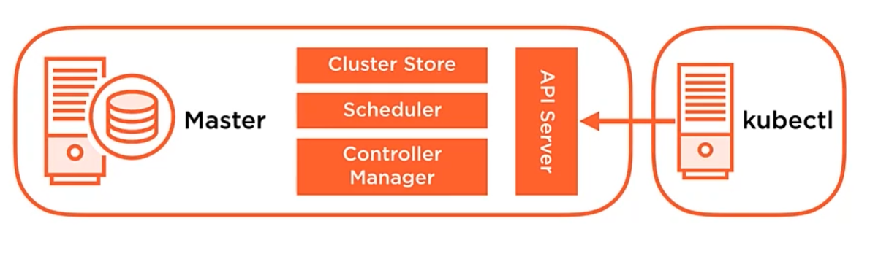
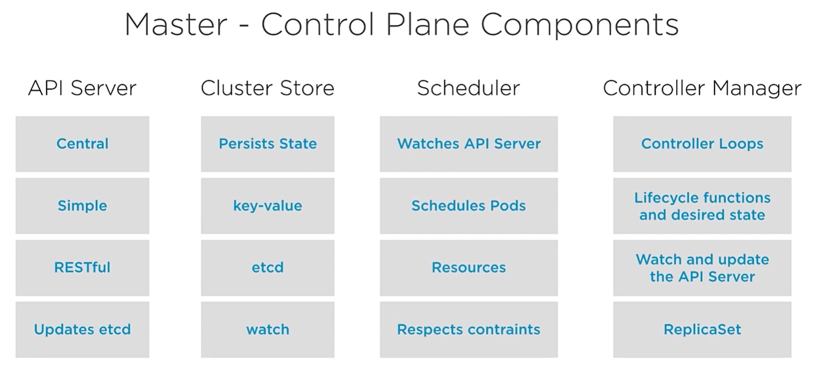
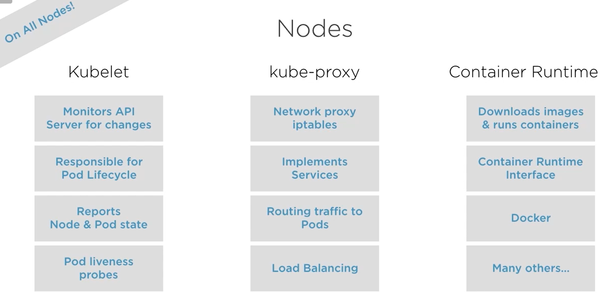
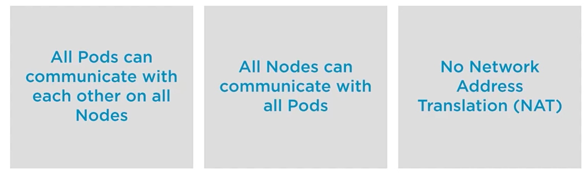
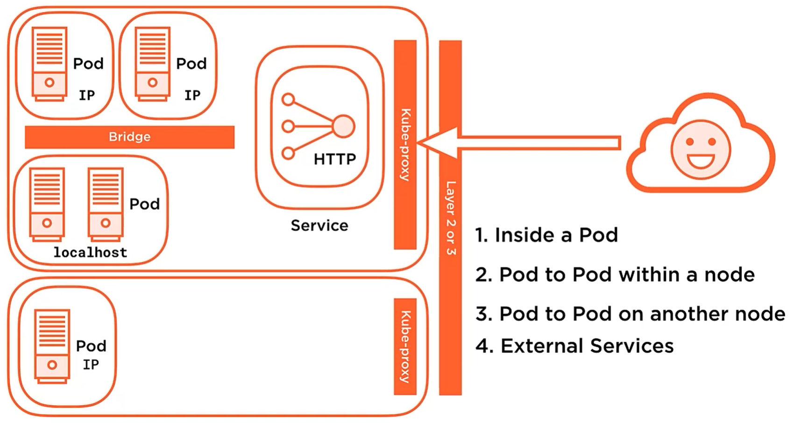

# Kubernetes Principles :nerd_face:
## Desired State
Declarative Configuration
## Controllers
Control loops
## One master
The API Server

RESTful API over HTTP using JSON -> The sole way to interact with the cluster

# Key Players
## Kubernetes API Objects
### Pods
Single or collection of containers
### Controllers
Keep our system in design state
### Services
Provides a persistence access point to deploy containers into pods.
### Storage
Storage data for the applications

# Pods
* One or more containers
* It's your application or service
* The most basic unit of work
* Unit of scheduling
* Ephemeral - no Pod is ever "redeployed"
* Atomicity - they're there or NOT
* Kubenretes' job is keeping your Pods running
* more specifically keeping the desired state (state is the Pod up and running, health is the application in the Pod runnign)

# How kubernetes manage its pods state?
## Controllers is the answear, they create and manage Pods for you
* Define your desired state* Respond to Pod state and health
* ReplicaSet - Number of replicas
* Deployment - manage rollout of ReplicaSet

# So how does kubernetes add persistency to all this ephemerality?
## Services are the answear
* It adds persistency to our ephemeral world
* Networking abstraction for Pod access
* IP and DNS name of rthe service
* Redeployed Pods automatically updates
* Scaled by adding/removing Pods
* Load balancing

# Cluster Components
## Mater
* Implements the master function of the cluster
* Node implements network and ensure that the pod is working
* Scheduled/Add ons components are pods that provide services to the cluster, one of these are DNS service
* Kubeclt is the client that we use to send commands to our cluster.

## Node
### Fundamental Node components
Kubelet | Kube-proxy | Container Runtime
--------|------------|-------------------
*Responsible to start our pods | *Responsible for communication | Gets the container image from registry and provide execution environment

*Communicate directly with API Server, monitoring for changes

# Kubernetes Networking Requirements
In Kubernetes networking have some rules to follow

